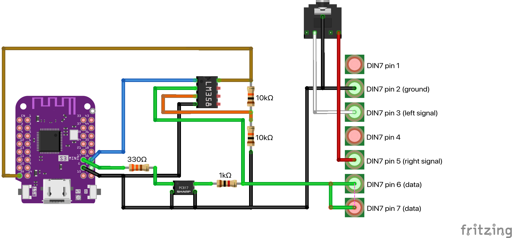
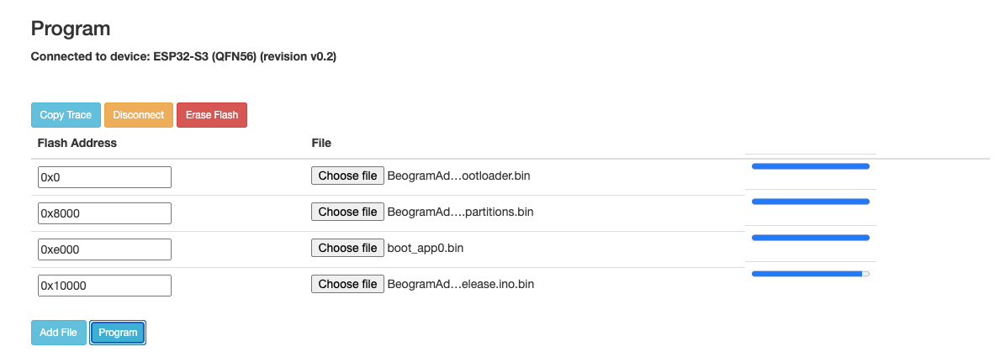
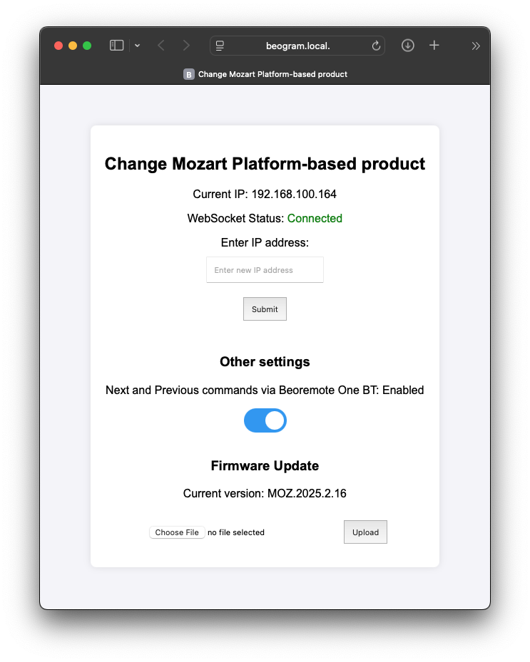

# BeogramAdaptor
This project uses an ESP32 to connect to a Bang & Olufsen Connected Audio product, and will send simple commands to a Beogram player whenever Line-in is selected. See more info below.


### Compatible with all Bang & Olufsen Connected Audio products that feature a Line-in source * / **
Can be used with any Bang & Olufsen Beogram with built-in RIAA, plus Beogram CD players, as long as they include Data Link (7-pin DIN).

_Be aware that if you're using a record player without a built-in RIAA pre-amp, you will need a pre-amp that pass-through the Data Link data-signal. I am currently only aware of this one: https://shop.oneremote.dk/shop/69068-riaa-forstaerker/4199-riaa-ii/ and I haven't tested the functionality. There is a chance that the data ground from the DIN-plug of the BeogramAdaptor needs to be connected to the shield instead of pin 2, in order to work._

Here is a list of record players that feature Data Link and a built-in RIAA pre-amp:
- Beogram 3500
- Beogram 4500
- Beogram 6500
- Beogram 7000

Also tested successfully with Beogram CD6500 (which means that it PROBABLY also works with most other Beogram CD models with Data Link).

_*Some products support Line-In through a passive USB-C to 3.5mm jack adaptor - but not all!_ <br>
_** I have **not** tested this on a product with Google Assistant built-in._

# How does it work?
Basically, this is a female 7-pin DIN to male 3.5mm jack cable/adaptor with a little piece of electronics attached to it. Your Beogram player connects to the female DIN plug. The 3.5mm jack connects to Line-in on the B&O Connected Audio product.

In the DIN-end of the cable an ESP32 is connected to the data pins from the Beogram player. The ESP32 requires a separate USB power supply.


# Hardware
Since the Data Link bus is running on 5V and an ESP32 accepts 3.3V on the GPIO pins, we need to add a little hardware. Also, Data Link is sending and receiving on the same wire, so we needed to do some trickery to get communication in both directions.

I have built my prototype using:
- 1x Wemos S3 Mini (https://www.aliexpress.com/item/1005005449219195.html)
- 1x LM358N op-amp
- 1x EL817 optocoupler
- 1x 330ohm resistor
- 1x 1K resistor

Diagram:




# How to install
If you have an existing BeogramAdaptor and you want to update the board, go to _beogram.local_ and update using the OTA-release files from this repository.


If you want to install the BeogramAdaptor from scratch, download the release package (.zip), which includes 4 .bin files.

Connect your Wemos ESP32 S3 Mini board to your computer via USB, and go to https://espressif.github.io/esptool-js/ (you must use the Chrome browser).

In the Program field, ensure that the Baudrate is set to 921600. Press **Connect**. Select your ESP32 (mine is called cu.usbmodem1101, but YMMV), and press **Connect**.


Now a new field appears: **Flash Address**. In the right-hand side you can select a file. We need 4 lines filled out exactly as shown below. For each line, press **Add file.**



| Flash address | File |
| -------- | ------- |
| 0x0 | x.bootloader.bin |
| 0x8000 | x.partitions.bin |
| 0xe000 | boot_app0.bin |
| 0x10000 | x.release.bin |

Once this is filled out, press the **Program** button. The flashing process usually takes around 30 seconds.


# Setup
Once it is powered on it will start a Soft AP called _Beogram_ that you can connect to (password is _password_), which allows you to add the credentials to your own WiFi network.

As soon as it is connected, enter _beogram.local_ in your browser.

Here you can enter the IP-address of the product you have connected the Beogram to. Press Submit to save.
The ESP32 now will monitor the event stream from the Mozart or ASE-based product.




# Usage and limitations
Now you are ready to use the system.
You can start the Beogram player from the Mozart or ASE-based product, the app, a Beoremote Halo and/or a Beoremote One BT by selecting the **Line-in** source.


Changing source away from Line-in will send a STOP command to the Beogram (pause, basically). 

Activating Line-in again will send PLAY and resume from the point where you left off (note: the Beogram will automatically turn off after x minutes in STOP-mode).


Sending a Standby or All-standby to the product from any interface will turn off the record player.


**_Mozart Platform-based products only:_**
Next and previous works directly on the Mozart product (the < and > buttons are turned off when using Line-in, but they will still work). 


With a connected Beoremote One BT you can use |<< and >>| to change track (once enabled on the webpage _beogram.local_). 
_Remember to toggle this setting off before disconnecting the Mozart product, e.g. if you're switching to a different product._


It is not possible to change track using the app or Beoremote Halo. Neither is it possible to change track from another room that has joined the experience.


Play/Pause works directly on the Mozart product, from the app and Beoremote One. Halo does not support Play/Pause when using Line-in.


Here is an example of the usage with a Beoremote One:

[](https://www.youtube.com/watch?v=2GDzm5rNWII)


**_ASE platform-based products only_:**
When using the ASE-version of the Beogram Adaptor it is not possible to activate Play, Pause, Next or Previous directly on the product. 

To activate these using a Beoremote One BT, ensure that Line-in is selected. Press List on Beoremote One BT, ensure that **Control** is shown in the remote list, and then press >, ||, |<< or >>| to control the Beogram player.


# REST calls
For testing or integration with a control system, you can send commands directly to the Beogram player. I highly recommend using the IP address instead of beogram.local for these requests, as DNS lookup slows things down significantly.

Example: ```curl --location --request POST 'http://192.168.100.37/command/next'```


Play: POST <ip>/command/play

Stop: POST <ip>/command/stop

Next: POST <ip>/command/next

Prev: POST <ip>/command/prev

Standby: POST <ip>/command/standby
